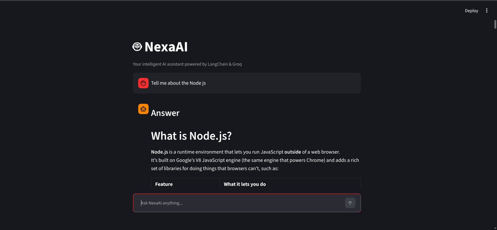
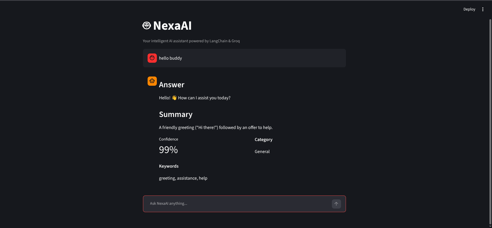

# NexaAI 

A simple AI chatbot built with **LangChain, Groq, Pydantic, and Streamlit**. NexaAI demonstrates important LangChain Runnable concepts including `RunnableBranch` and `RunnableParallel`, while using Pydantic for structured AI responses.

---

## 1. Project Overview

**NexaAI** is a Streamlit-based AI chatbot designed to demonstrate how different LangChain components can be combined to build a structured conversational AI application.

The chatbot uses a **Groq-hosted Large Language Model (LLM)** to process user questions. Before generating a response, the user's question is classified into one of three categories:

* Programming
* Math
* General

Based on the classification, `RunnableBranch` routes the question to the appropriate prompt pipeline.

The selected pipeline then uses `RunnableParallel` to generate multiple outputs from the same user request:

* Main Answer
* Summary

Finally, the generated response is converted into a structured format using a **Pydantic `BaseModel`** and displayed through the Streamlit chat interface.

### Technology Stack

* Python
* LangChain
* LangChain Core
* LangChain Groq
* Groq
* Pydantic
* Streamlit
* Python Dotenv

---

## 2. Features

###  Groq-Powered AI Chatbot

NexaAI uses the `ChatGroq` integration to communicate with a Large Language Model.

###  PromptTemplate

Separate prompt templates are created for different types of questions.

The application uses dynamic prompt variables instead of writing prompts directly inside `invoke()`.

###  RunnableBranch

The chatbot dynamically routes questions into different pipelines:

* Programming Assistant
* Math Assistant
* General Assistant

###  RunnableParallel

The selected pipeline generates multiple outputs from the same user request:

* Answer
* Summary

### Pydantic Structured Output

The AI response follows a predefined Pydantic schema containing:

* `answer`
* `summary`
* `confidence`
* `category`
* `keywords`

###  Streamlit Chat Interface

The application provides:

* Chat interface
* Chat history
* User input box
* AI response display
* Clear chat functionality

###  Environment Variables

The Groq API key is stored securely using environment variables instead of being hardcoded into the source code.

---

# 3. RunnableBranch Implementation

`RunnableBranch` is used to route the user's question to a different processing pipeline depending on its classification.

### Classification Flow

```text
        User Question
            │
            ▼
    Classification Chain
            │
            ▼
 ┌─────────────────────┐
 │ Question Category   │
 └──────────┬──────────┘
            │
      ┌─────┼─────┐
      ▼     ▼     ▼
 Programming Math General
      │     │     │
      ▼     ▼     ▼
   Programming
     Chain
      │
      ▼
```

The classification chain uses a dedicated prompt to classify the question as:

```text
programming
math
general
```

The result is then used by `RunnableBranch`.

### Example Implementation

```python
branch_chain = RunnableBranch(
    (
        lambda x: x["classification"] == "programming",
        programming_chain,
    ),
    (
        lambda x: x["classification"] == "math",
        math_chain,
    ),
    general_chain,
)
```

The first matching condition determines which chain is executed.

For example:

```text
"What is a Python decorator?"
        ↓
Programming
        ↓
Programming Chain
```

Another example:

```text
"What is the derivative of x²?"
        ↓
Math
        ↓
Math Chain
```

And:

```text
"What is the capital of Bangladesh?"
        ↓
General
        ↓
General Chain
```

This allows NexaAI to provide more specialized responses for different categories of questions.

---

# 4. RunnableParallel Implementation

`RunnableParallel` is used to generate multiple outputs simultaneously from the same user request.

For this project, the selected branch generates:

1. Main Answer
2. Summary

### Workflow

```text
                User Question
                      │
                      ▼
              RunnableBranch
                      │
                      ▼
              Selected Chain
                      │
                      ▼
             RunnableParallel
                ┌─────┴─────┐
                ▼           ▼
             Answer      Summary
                │           │
                └─────┬─────┘
                      ▼
              Structured Output
```

### Example Implementation

```python
programming_chain = RunnableParallel(
    answer=programming_answer_prompt | model | str_parser,
    summary=programming_summary_prompt | model | str_parser,
)
```

The same approach is used for the Math and General chains.

### Why RunnableParallel?

Instead of generating the answer first and then generating the summary sequentially, both outputs are defined as independent runnable tasks.

Conceptually:

```text
RunnableParallel
      │
      ├── Answer Chain
      │
      └── Summary Chain
```

This directly satisfies the requirement of generating multiple meaningful outputs from a single user request.

---

# 5. Pydantic Structured Output Implementation

NexaAI uses **Pydantic `BaseModel`** to define the expected structure of the AI response.

The schema is defined in `schema.py`.

```python
from pydantic import BaseModel, Field


class AIResponse(BaseModel):
    answer: str = Field(
        description="The main answer to the user's question."
    )

    summary: str = Field(
        description="A concise summary of the answer."
    )

    confidence: float = Field(
        ge=0.0,
        le=1.0,
        description="Confidence score between 0 and 1."
    )

    category: str = Field(
        description="Question category: Programming, Math, or General."
    )

    keywords: list[str] = Field(
        description="Important keywords related to the question."
    )
```

The model is then configured to return structured output:

```python
structured_llm = model.with_structured_output(AIResponse)
```

This ensures that the final response follows the defined Pydantic structure instead of returning only plain text.

### Example Output

For the question:

```text
What is a Python decorator?
```

NexaAI may produce:

```json
{
  "answer": "A Python decorator is a function that modifies or extends the behavior of another function without changing its source code.",
  "summary": "Decorators modify the behavior of functions.",
  "confidence": 0.96,
  "category": "Programming",
  "keywords": [
    "Python",
    "decorator",
    "function"
  ]
}
```

The Streamlit application displays these structured fields to the user.

---

# 6. Installation Instructions

## Prerequisites

Make sure the following are installed:

* Python 3.10+
* Git
* A Groq API key

---

## Clone the Repository

```bash
git clone https://github.com/your-username/NexaAI.git
```

Move into the project directory:

```bash
cd NexaAI
```

---

## Create a Virtual Environment

Linux/macOS:

```bash
python -m venv .venv
source .venv/bin/activate
```

Windows:

```bash
python -m venv .venv
.venv\Scripts\activate
```

---

## Install Dependencies

```bash
pip install -r requirements.txt
```

---

## Configure Environment Variables

Create a `.env` file in the project root:

```env
GROQ_API_KEY=your_groq_api_key
```

Do not commit the `.env` file to GitHub.

The repository should contain `.env.example`:

```env
GROQ_API_KEY=your_groq_api_key_here
```

---

## Run the Application

Start the Streamlit application:

```bash
streamlit run app.py
```

The application will open in your browser.

---

# 7. Screenshots

Screenshots of the NexaAI application are stored inside the `assets/` directory.

### Chat Interface



### Structured AI Response




---

# 8. Project Structure

```text
NexaAI/
│
├── app.py
├── chatbot.py
├── prompt.py
├── schema.py
├── requirements.txt
├── .env.example
├── .gitignore
├── README.md
│
└── assets/
    ├── chat-interface.png
    ├── structured-response.png
    └── chat-history.png
```

### File Responsibilities

| File               | Responsibility                                            |
| ------------------ | --------------------------------------------------------- |
| `app.py`           | Streamlit interface and chat history                      |
| `chatbot.py`       | LangChain chains, routing, parallel processing, and model |
| `prompt.py`        | Prompt templates                                          |
| `schema.py`        | Pydantic response schema                                  |
| `requirements.txt` | Python dependencies                                       |
| `.env.example`     | Environment variable template                             |
| `README.md`        | Project documentation                                     |
| `assets/`          | Application screenshots                                   |

---

# 9. Conclusion

NexaAI demonstrates how LangChain's Runnable architecture can be used to build a simple and structured AI chatbot.

The project implements `PromptTemplate` for dynamic prompt construction, `RunnableBranch` for conditional routing, and `RunnableParallel` for generating multiple outputs from a single user request.

The use of Pydantic structured output ensures that AI responses follow a predefined schema containing the answer, summary, confidence, category, and keywords.

Finally, Streamlit provides a simple interactive interface with chat history and structured AI response display.

Overall, NexaAI provides a practical demonstration of combining **LangChain, Groq, Pydantic, and Streamlit** to build a modular AI chatbot.

---

## Technologies

```text
Python
LangChain
LangChain Core
ChatGroq
Groq
Pydantic
Streamlit
Python Dotenv
```

**Built as a LangChain learning project.**
